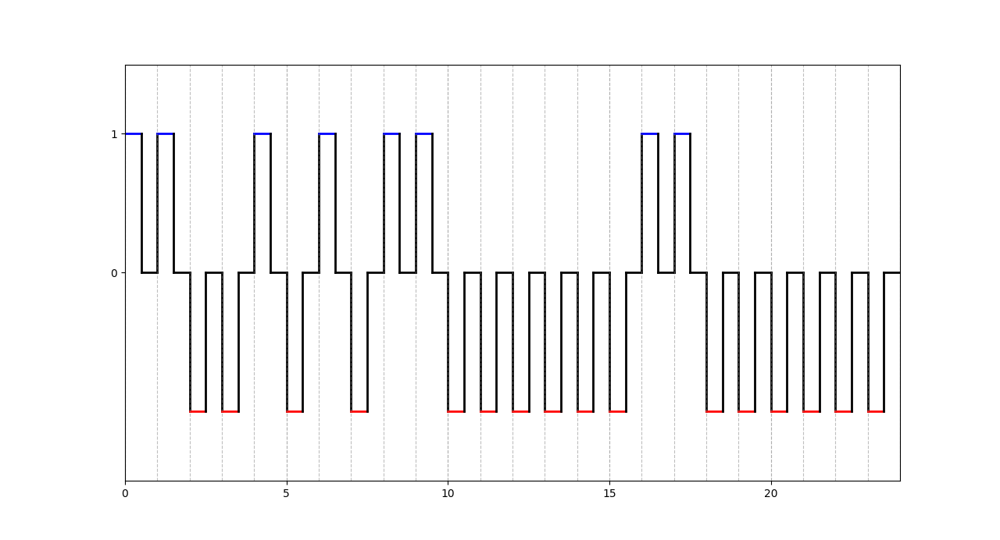
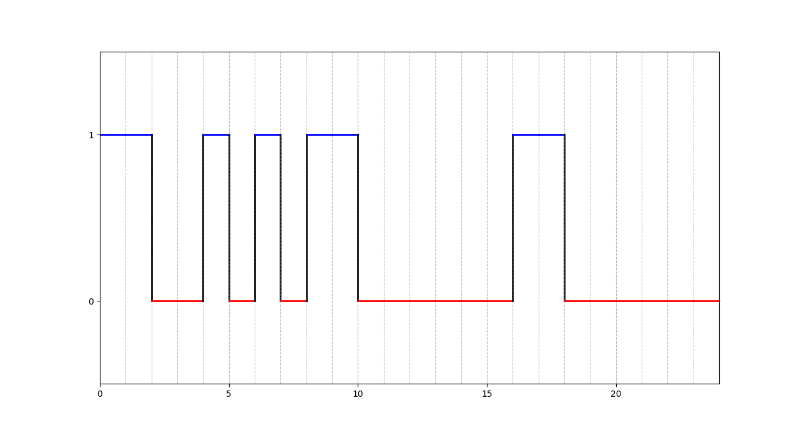
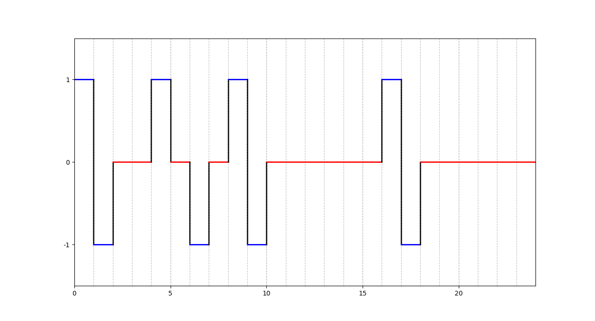
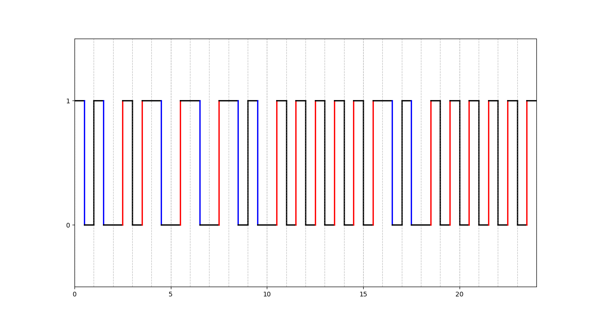
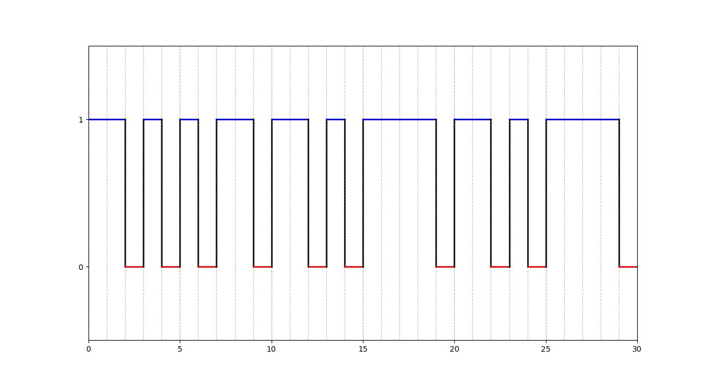
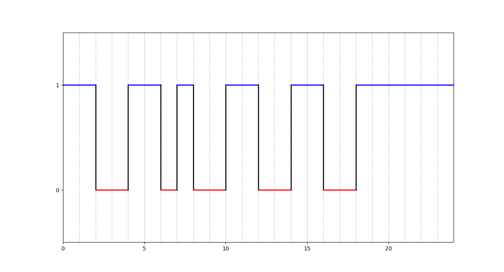

# Домашняя работа

## Цель работы

Цель работы: изучение методов физического и логического кодирования,
используемых в цифровых сетях передачи данных.

## Задание

- Выполнить физическое кодирование исходного сообщения не менее, чем тремя методами кодирования, выбрав из множества: NRZ, RZ, AMI, MLT-3, NRZI, PAM-5, манчестерский и дифференциальный манчестерский код, а также логическое кодирование для одного из них;
- Рассчитать частотные характеристики сигналов, формируемых для передачи исходного сообщения, и требуемую полосу пропускания канала связи;
- Провести качественный и количественный сравнительный анализ рассмотренных методов кодирования, выявить и сформулировать достоинства и недостатки;
- Выбрать наилучший метод для передачи исходного сообщения.

## Ход работы

### Формирование сообщения

| Исходное сообщение | КАА |
| --- | --- |
| В шестнадцатеричном коде | CA C0 C0 |
| В двоичном коде | 11001010 11000000 11000000 |
| Длина сообщения | 3 байта (24 бита) |
| Пропускная способность канала | 100 Мбит |

### Физическое кодирование

#### Метод RZ

- **Верхняя** граница частот: $ T=t, t= \frac{1}{c} \rightarrow f_в = \frac{1}{T} = C = 100 $ Мгц

- **Нижняя** граница частот: $ T=2t \rightarrow f_н = \frac{C}{2} = 50 $ МГц

- **Середина спектра**: $f_{\frac{1}{2}} = \frac{f_в + f_н}{2} = 75 $ МГц

- **Среднее значение** частоты: $f_{ср} = \frac{48f_0}{48} = 100 $ МГц

- Полоса пропускания: $ f_в - f_н = 50 $ МГц

#### Метод NRZ

- **Верхняя** граница частот: $ T=2t, t= \frac{2}{c} \rightarrow f_в = \frac{2}{T} = C = 50 $ Мгц

- **Нижняя** граница частот: $ T=12t, t= \frac{12}{c} \rightarrow f_в = \frac{12}{T} = C = 8.33 $ Мгц

- **Середина** спектра: $f_{\frac{1}{2}} = \frac{f_в + f_н}{2} = 29.17 $ МГц

- **Среднее значение** частоты: $f_{ср} = \frac{4f_0+8\frac{f_0}{2}+12\frac{f_0}{6}}{24} = 20.83 $ МГц

- Полоса пропускания: $f_в - f_н = 41.67$ МГц

#### Метод AMI

- **Верхняя** граница частот: $ T=2t, t= \frac{2}{c} \rightarrow f_в = \frac{2}{T} = C = 50$ Мгц

- **Нижняя** граница частот: $ T=12t, t= \frac{12}{c} \rightarrow f_в = \frac{12}{T} = C = 8.33 $ Мгц

- **Середина** спектра: $f_{\frac{1}{2}} = \frac{f_в + f_н}{2} = 29.17 $ МГц

- **Среднее значение** частоты: $f_{ср} = \frac{10f_0+2\frac{f_0}{2}+12\frac{f_0}{6}}{24} = 27.08$ МГц

- Полоса пропускания: $f_в - f_н = 41.67$ МГц

#### Манчестерский Метод

- **Верхняя** граница частот: $ T=t, t= \frac{1}{c} \rightarrow f_в = \frac{1}{T} = C = 100 $ Мгц

- **Нижняя** граница частот: $ T=2t, t= \frac{2}{c} \rightarrow f_в = \frac{2}{T} = C = 50$ Мгц

- **Середина** спектра: $f_{\frac{1}{2}} = \frac{f_в + f_н}{2} = 75 $ МГц

- **Среднее значение** частоты: $f_{ср} = \frac{30f_0+18\frac{f_0}{2}}{48} = 81.25$ МГц

- Полоса пропускания: $f_в - f_н = 50$ МГц

#### Сравнение методов

|Метод|Спектр сигнала (МГц)|Постоянная составляющая|Самосинхронизация|Обнаружение ошибок|Стоимость реализации|
|---|---|---|---|---|---|
|RZ|50|нет|есть|есть|3|
|NRZ|41.67|есть|нет|нет|2|
|AMI|41.67|есть|нет|есть|3|
|Манчестер|50|нет|есть|есть|2|

### Логическое кодирование

| Исходное сообщение | КАА |
| --- | --- |
| В шестнадцатеричном коде | D5 B5 ED 78 |
| В двоичном коде | 1101010110 1101011110 1101011110 |
| Длина сообщения | 3.75 байта (30 бит) |
| Пропускная способность канала | 100 Мбит |

- **Верхняя** граница частот: $ T=2t, t= \frac{2}{c} \rightarrow f_в = \frac{2}{T} = C = 50$ Мгц

- **Нижняя** граница частот: $ T=8t, t= \frac{8}{c} \rightarrow f_в = \frac{8}{T} = C = 12.5 $ Мгц

- **Середина** спектра: $f_{\frac{1}{2}} = \frac{f_в + f_н}{2} = 31.25 $ МГц

- **Среднее значение** частоты: $f_{ср} = \frac{14f_0+8\frac{f_0}{2}+8\frac{f_0}{4}}{30} = 33.33$ МГц

- Полоса пропускания: $f_в - f_н = 37.25$ МГц

### Скремблирование сообщения

Выберем полином $B_i = A_i \oplus B_{i-5} \oplus B_{i-7}$, так как он обеспечивает избавление от длинных последовательностей 0 и 1 не так быстро, как полином $B_i = A_i \oplus B_{i-3} \oplus B_{i-5}$ (в моем случае длинных последовательностей 0 и 1 в начале нет)  

$$ B_1 = A_1 = 1 $$
$$ B_2 = A_2 = 1 $$
$$ B_3 = A_3 = 0 $$
$$ B_4 = A_4 = 0 $$
$$ B_5 = A_5 = 1 $$
$$ B_6 = A_6 \oplus B_1 = 1 $$
$$ B_7 = A_7 \oplus B_2 = 0 $$
$$ B_8 = A_8 \oplus B_3 \oplus B_1 = 1 $$
$$ B_9 = A_9 \oplus B_4 \oplus B_2 = 0 $$
$$ B_{10} = A_{10} \oplus B_5 \oplus B_3 = 0 $$
$$ B_{11} = A_{11} \oplus B_6 \oplus B_4 = 1 $$
$$ B_{12} = A_{12} \oplus B_7 \oplus B_5 = 1 $$
$$ B_{13} = A_{13} \oplus B_8 \oplus B_6 = 0 $$
$$ B_{14} = A_{14} \oplus B_9 \oplus B_7 = 0 $$
$$ B_{15} = A_{15} \oplus B_{10} \oplus B_8 = 1 $$
$$ B_{16} = A_{16} \oplus B_{11} \oplus B_9 = 1 $$
$$ B_{17} = A_{17} \oplus B_{12} \oplus B_{10} = 0 $$
$$ B_{18} = A_{18} \oplus B_{13} \oplus B_{11} = 0 $$
$$ B_{19} = A_{19} \oplus B_{14} \oplus B_{12} = 1 $$
$$ B_{20} = A_{20} \oplus B_{15} \oplus B_{13} = 1 $$
$$ B_{21} = A_{21} \oplus B_{16} \oplus B_{14} = 1 $$
$$ B_{22} = A_{22} \oplus B_{17} \oplus B_{15} = 1 $$
$$ B_{23} = A_{23} \oplus B_{18} \oplus B_{16} = 1 $$
$$ B_{24} = A_{24} \oplus B_{19} \oplus B_{17} = 1 $$

| Исходное сообщение | КАА |
| --- | --- |
| Результирующее сообщение | 11001101 00110011 00111111 |
| В шестнадцатеричном коде | CD 33 3F |
| Длина сообщения | 3 байта (24 бита) |
| Пропускная способность канала | 100 Мбит |

- **Верхняя** граница частот: $ T=2t, t= \frac{2}{c} \rightarrow f_в = \frac{2}{T} = C = 50$ Мгц

- **Нижняя** граница частот: $ T=12t, t= \frac{12}{c} \rightarrow f_в = \frac{8}{T} = C = 8.33 $ Мгц

- **Середина** спектра: $f_{\frac{1}{2}} = \frac{f_в + f_н}{2} = 29.17 $ МГц

- **Среднее значение** частоты: $f_{ср} = \frac{2f_0+16\frac{f_0}{2}+6\frac{f_0}{6}}{24} = 22.92$ МГц

- Полоса пропускания: $f_в - f_н = 41.67$ МГц

### Сравнительный анализ

| Метод | Передаем только полезные данные | Синхронизация | Нахождение ошибок | Усложнение реализации |
| --- | --- | --- | --- | --- |
| NRZ | да | нет | нет | нет |
| 4B/5B | нет | да | да | да |
| Скремблирование | да | нет | нет | да |

4B/5B позволяет добавить новые свойства к методу передачи, которых у него не могло быть изначально, однако требует хранения таблицы для конвертации и при использовании этого метода мы соглашаемся на то, что часть передаваемых нами данных будет излишни

Скремблирование позволяет не усложняя само сообщение сделать его более сбалансированным. Другим плюсом скремблирования является простота его реализации непосредственно для компьютера. Однако скремблирование не всегда может гарантировать уменьшение длины максимальной последовательности 0 или 1

## Вывод

В ходя работы я познакомился с базовыми методами физического кодирования, а также узнал о способах логического кодирования: избыточном и скремблировании. Помимо этого, я также провел сравнительный анализ этих методов на конкретном сообщении
