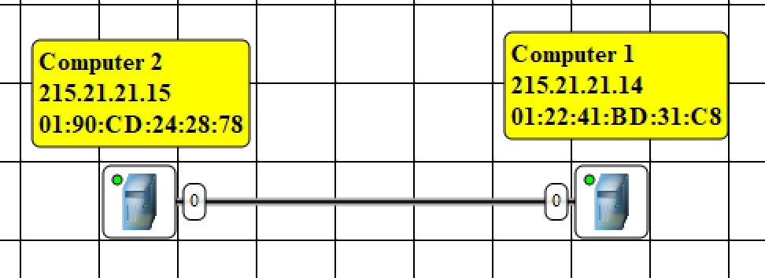
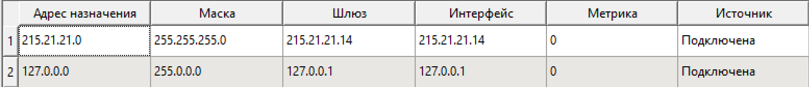
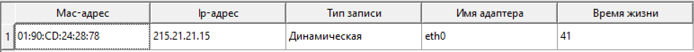
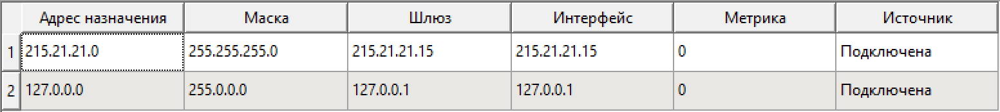
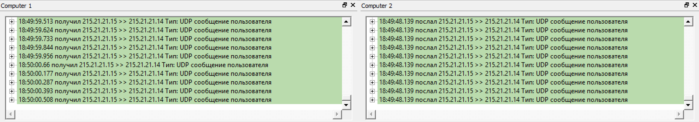

# Лабораторная работа 1

Гуппа:

- Кузьмин Артемий Андреевич
- Трусковский Георгий Александрович

## Цель работы

Изучение принципов построения и настройки моделей компьютерных
сетей в среде NetEmul.

В процессе выполнения лабораторной работы (ЛР) необходимо:

- построить три простейшие модели компьютерной сети;
- выполнить настройку сети, заключающуюся в присвоении IP-адресов
интерфейсам сети;
- выполнить тестирование разработанных сетей путем проведения
экспериментов по передаче данных на основе протокола UDP;
- сохранить разработанные модели компьютерных сетей для демонстрации
процессов передачи данных при защите лабораторной работы.

## Ход работы

Вариант: `215.21.21.14`

### Знакомство с NetEmul на примере простейшей сети из двух компьютеров

Схема сети описана в файле [task1.net](./src/task1.net)

Изображение схемы

Таблица маршрутизации для `Computer 1`

arp-таблица для `Computer 1` после приема сообщения

Таблица маршрутизации для `Computer 2`

arp-таблица для `Computer 2` после отправки сообщения

Журналы компьютеров

### Линейная сеть из трех компьютеров

### Полносвязная сеть из трех компьютеров

## Вывод
