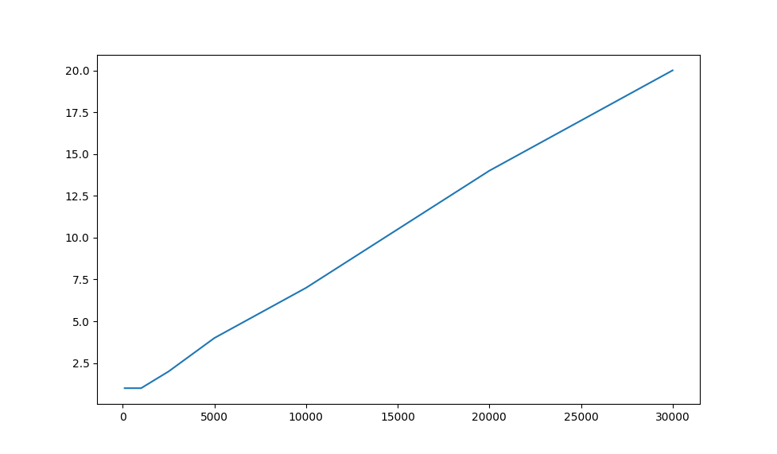

# Лабораторная работа 4

- Выполнили:
  - Кузьмин Артемий Андреевич
  - Трусковский Георгий Александрович
- Проверил:
  - Тропченко Андрей Александрович

## Цель работы

Цель работы – изучить структуру протокольных блоков данных, анализируя реальный трафик на компьютере студента с помощью бесплатно распространяемой утилиты Wireshark.

В процессе работы необходимо выполнить наблюдения за передаваемым трафиком с компьютера пользователя в Интернет и в обратном направлении. Применение специализированной утилиты Wireshark позволяет наблюдать структуру передаваемых кадров, пакетов и сегментов данных различных сетевых протоколов. При выполнении работы рекомендуется выполнить анализ последовательности команд и определить назначение служебных данных, используемых для организации обмена данными в протоколах: ARP, DNS, FTP, HTTP, DHCP.

## Задание

1. Анализ трафика утилиты ping
2. Анализ трафика утилиты tracert (traceroute)
3. ???

## Ход выполнения

Вариант: [https://kaaproject.github.io/kaa/docs/v0.10.0/Welcome/](https://kaaproject.github.io/kaa/docs/v0.10.0/Welcome/)

### Анализ трафика утилиты ping

Будем выполнять команду, постепенно увеличивая размер пакета

```bash
ping -s <размер пакета> -c 10 kaaproject.github.io
```

Пойманные пакеты доступны в файле [ping.pcapng](./res/ping.pcapng)

#### Структура пакетов

Утилита `ping` использует протокол ICMP. Протокол отправляет эхо-запрос и получает эхо-ответ, фиксируя время перемещения пакета туда и обратно. Разберем структуру пакетов


- Ethernet II (Канальный уровень)
  - `Destination` - MAC-адрес шлюза по умолчанию
  - `Source` - MAC-адрес устройства
  - `Type` - поле типа протокола

- IPv4 (Сетевой уровень)
  - `Source` - ip источника
  - `Destination` - ip назначения
  - `Protocol` - протокол
  - `Version` - версия
  - `Header Length` - длина заголовка
  - `Header Checksum` - контрольная сумма заголовка
  - `Fragment offset` - смещение фрагмента
  - `Flags` - флаги
  - `Time to Live` - ограничение количества хопов
  - `Indetification` - идентификатор фрагмента

- ICMP (Сетевой уровень в OSI, поверх IP)
  - `Type` - код операции
  - `Checksum` - контрольная сумма
  - `Identifier` - уникальный id
  - `Sequence number` - порядковый номер запроса
  - `Data` - полезная нагрузка

#### Ответы на вопросы

1. **Имеет ли место фрагментация исходного пакета, какое поле на это указывает?**  
  Да, фрагментация имеет место, когда размер ICMP-пакета (заголовок + данные) вместе с IP-заголовком превышает Maximum Transmission Unit (MTU) сети. На это указывает поле `Flags` в IP-заголовке. Если установлен флаг More fragments, значит, этот пакет — не последний фрагмент. Также поле Fragment Offset будет ненулевым у всех фрагментов, кроме первого, указывая его положение в исходном потоке данных.

2. **Какая информация указывает, является ли фрагмент пакета последним или промежуточным?**  
  Если флаг More fragments установлен в 1, то после это промежуточный фрагмент, если флаг More fragments равен 0, то это последний фрагмент.

3. **Чему равно количество фрагментов при передаче ping-пакетов?**  
  Количество фрагментов равно размер пакета разделить на размер фрагмента

4. **Построить график зависимости количества фрагментов от размера пакета?**  
  

5. **Как изменить поле TTL с помощью утилиты ping?**  
  Команда для установки TTL, например, в 128:  

    ```bash
    ping -s 100 -m 128 -c 4 kaaproject.github.io
    ```

6. **Что содержится в поле данных ping-пакета?**
  В поле данных ping-пакета обычно содержится последовательность символов английского алфавита, которая циклично повторяется для заполнения заданного объема, а также timestamp

### Анализ трафика утилиты tracert (traceroute)

Запустим команду

```bash
sudo traceroute -I -n kaaproject.github.io
```

Так как используется протокол ICMP из предыдущего этапа, разбирать его структуру еще раз не будем

#### Ответы на вопросы

1. **Сколько байт содержится в заголовке IP? Сколько байт содержится в
поле данных?**  
  Заголовок состоит из 20 байт. Полем данных для IP будет содержимое ICMP пакета, то есть 8 байт заголовок + поле данных ICMP пакета

2. **Как и почему изменяется поле TTL в следующих друг за другом ICMP-
пакетах tracert? Для ответа на этот вопрос нужно проследить изменение
TTL при передаче по маршруту, состоящему из более чем двух хопов**  
  Утилита отправляет серию пакетов с TTL, увеличивающимся на 1: сначала `TTL=1`, потом `TTL=2`, `TTL=3` и т.д.
  Это позволяет `traceroute` определить все узлы на пути

3. **Чем отличаются ICMP-пакеты, генерируемые утилитой tracert, от ICMP-
пакетов, генерируемых утилитой ping (см. предыдущее задание).**
  Пакеты в `ping` и `traceroute` будет отличаться по TTL (в `traceroute` это значение не фиксированное), также отличается поле данных, в `ping` оно фиксированное и заполняется в алфавитном порядке, в `traceroute` пустое или заполнено нулями

4. **Чем отличаются полученные пакеты «ICMP reply» от «ICMP error» и
зачем нужны оба этих типа ответов?**
  ICMP reply приходит от конечного узла, ICMP error от промежуточных. С точки зрения пакетов, у них отличается значение в поле Type в заголовке ICMP

5. **Что изменится в работе tracert, если убрать ключ «-d»? Какой
дополнительный трафик при этом будет генерироваться?**
  Утилита начнет для каждого полученного IP-адреса маршрутизатора выполнять обратный DNS-запрос, чтобы определить его доменное имя

### ???

## Вывод
